# Notas SQL
- _DBeaver, SQL Server Management Studio (SSMS), MySQL Workbench se llaman software de administración de bases de datos_
- _Las colecciones de bases de datos se llaman "Conexiones" o "Conexiones de base de datos". Estas conexiones representan los accesos a las bases de datos y servidores específicos_
- MySQL es un servidor que se ejecuta en un host. Por este motivo, primero conectate por ssh al servidor remoto, y luego ejecutas con tus credenciales (se pide usuario y password):
```bash
mysql -u my_username -p
```

## Tipos de sentencias


## Sentencias SQL
SQL es un lenguaje de programación imperativo.

### Sentencias DDL
- Ver lista de bases de datos
```sql
SHOW DATABASES;
```
- Ver lista de índices de una tabla
```sql
SHOW INDEX FROM `my_database`.my_table;
```
- Crear base de datos
```sql
CREATE DATABASE my_database;
CREATE DATABASE IF NOT EXISTS my_database;
```
- Borrar base de datos (dejando referencias en memoria)
```sql
DROP DATABASE my_database;
DROP DATABASE IF EXISTS my_database;
```
- Crear tabla
```sql
CREATE TABLE IF NOT EXISTS `my_database`.my_table(
    id INT UNSIGNED AUTO_INCREMENT,
    name VARCHAR(50) NOT NULL,
    email VARCHAR(70) NOT NULL,
    PRIMARY KEY (id)
) ENGINE=InnoDB DEFAULT CHARSET=utf8mb4;
-- También se puede usar la sintaxis
CREATE TABLE IF NOT EXISTS `my_database`.my_table(
    id INT UNSIGNED AUTO_INCREMENT PRIMARY KEY,
    name VARCHAR(50) NOT NULL,
    email VARCHAR(70) UNIQUE NOT NULL,
    age INT DEFAULT 0,
);
```

- Claves foraneas

__La restricción por defecto es 'RESTRICT'__
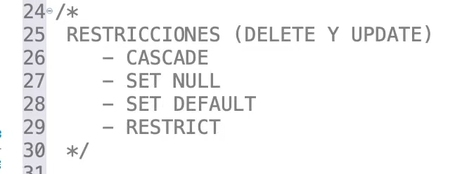
CASCADE:

Cuando se aplica la acción 'CASCADE' a una clave foránea, cualquier cambio realizado en la clave primaria correspondiente (la tabla principal) se reflejará automáticamente en las filas relacionadas de la tabla secundaria (aquella que contiene la clave foránea).
Por ejemplo, si se elimina una fila en la tabla principal, todas las filas relacionadas en la tabla secundaria serán eliminadas automáticamente.
SET DEFAULT:

Cuando se utiliza la acción 'SET DEFAULT', si se actualiza o elimina una fila en la tabla principal, la columna que contiene la clave foránea en la tabla secundaria se establecerá en un valor predeterminado.
Esto significa que si una fila en la tabla principal es modificada o eliminada y la fila correspondiente en la tabla secundaria hace referencia a esta fila modificada o eliminada, la columna que contiene la clave foránea en la tabla secundaria tomará un valor por defecto predefinido.
SET NULL:

Al emplear la acción 'SET NULL', si se actualiza o elimina una fila en la tabla principal, la columna que contiene la clave foránea en la tabla secundaria se establecerá en NULL (si la columna permite valores nulos).
En este caso, si una fila en la tabla principal es modificada o eliminada y la fila correspondiente en la tabla secundaria hace referencia a esta fila modificada o eliminada, la columna que contiene la clave foránea en la tabla secundaria se establecerá como NULL.
```sql
CREATE TABLE IF NOT EXISTS `my_database`.my_table(
    id INT UNSIGNED AUTO_INCREMENT PRIMARY KEY,
    name VARCHAR(50) NOT NULL,
    email VARCHAR(70) UNIQUE NOT NULL,
    age INT DEFAULT 0,
    agencia_id INT UNSIGNED NOT NULL, 
    FOREIGN KEY(agencia_id) REFERENCES `agencias`(id) ON DELETE SET NULL ON UPDATE CASCADE 
);
```

- Índices
```sql
-- Crear tabla con índices nombrados
CREATE TABLE IF NOT EXISTS `my_database`.my_table(
    id INT UNSIGNED AUTO_INCREMENT,
    name VARCHAR(50) NOT NULL,
    email VARCHAR(70) NOT NULL,
    PRIMARY KEY (id),
    INDEX i_email (email),
    INDEX i_name (name)
);
-- Se pueden crear varios índices nombrados distintos simultaneamente 
CREATE TABLE IF NOT EXISTS `my_database`.my_table(
    id INT UNSIGNED AUTO_INCREMENT,
    name VARCHAR(50) NOT NULL,
    email VARCHAR(70) NOT NULL,
    PRIMARY KEY (id),
    INDEX i_my_table (name, email)
);
-- Índices tipo full-text: Esto genera varios índices para cada campo involucrado
CREATE TABLE IF NOT EXISTS `my_database`.my_table(
    id INT UNSIGNED AUTO_INCREMENT,
    name VARCHAR(50) NOT NULL,
    email VARCHAR(70) NOT NULL,
    age INT NOT NULL,
    PRIMARY KEY (id),
    FULLTEXT INDEX fi_search (name, age, email)
);
```
- Agregar campos en la tabla
```sql
ALTER TABLE `my_database`.my_table ADD COLUMN phone VARCHAR(12) NOT NULL;
```
- Agregar restricciones en la tabla
```sql
-- Aquí 'pk_id' es el nombre de la clave, y (id) es el nombre del campo que será clave primaria
ALTER TABLE `my_database`.my_table ADD CONSTRAINT pk_id PRIMARY KEY (id);
ALTER TABLE `my_database`.my_table ADD CONSTRAINT uq_email UNIQUE (email);
ALTER TABLE `my_database`.my_table ADD INDEX i_email (email);
ALTER TABLE `my_database`.my_table ADD FULLTEXT INDEX fi_search (name, last_name, email);
-- Eliminar restricciones (en este caso comenzamos con el fulltext-index)
ALTER TABLE `my_database`.my_table DROP INDEX fi_search;
ALTER TABLE `my_database`.my_table DROP CONSTRAINT uq_email;
```
- Modificar tipo de dato en campos en la tabla
```sql
ALTER TABLE `my_database`.my_table MODIFY phone INT UNSIGNED AUTO_INCREMENT NOT NULL;
```
- Renombrar campos en la tabla
```sql
ALTER TABLE `my_database`.my_table RENAME COLUMN phone TO telefono;
```
- Eliminar campos en la tabla
```sql
ALTER TABLE `my_database`.my_table DROP COLUMN telefono;
```
- Eliminar tabla
```sql
DROP TABLE `my_database`.my_table;
```
- Especificar la base de datos que usaremos
```sql
-- Especificar la DB que usaremos
USE my_database;
-- Esta sentencia depende de la anterior
SHOW TABLES;
-- Mostrar caracteristicas de una tabla
DESCRIBE my_table;
```

### Sentencias DML
- Ver campos de registros
```sql
SELECT name, email, age FROM `my_database`;
SELECT name, email, age FROM `my_database` WHERE email = 'john@example.com' AND age = 18;
-- Sentencia WHERE con multiples valores
SELECT name, email, age FROM `my_database` WHERE email IN ('john@example.com', 'john@outlook.com');
SELECT name, email, age FROM `my_database` WHERE age BETWEEN 18 AND 150;
SELECT name, email, age FROM `my_database` WHERE email REGEXP '^[a-zA-Z0-9._%+-]+@[a-zA-Z0-9.-]+\.[a-zA-Z]{2,}$';
SELECT name, email, age FROM `my_database` WHERE email = 'john@example.com'
-- Mostrar registros usando comodines
-- Empiezan con 'M' y luego cualesquiera caracteres
SELECT email, age FROM `my_database` WHERE email LIKE 'M%';
SELECT email, age FROM `my_database` WHERE email LIKE '%@gmail.com';
SELECT email, age FROM `my_database` WHERE email NOT LIKE '%@hotmail.com';
-- Mostrar registros en tablas con índices FULLTEXT
SELECT * FROM `my_database` WHERE MATCH (name, age, email) AGAINST ('Palabra a buscar', IN BOOLEAN MODE);
-- Paginación (primer párametro es el índice, y el segundo es la cantidad de datos mostrados)
SELECT * FROM `my_database` LIMIT 5, 7;
-- Mostrar cantidad de registros
SELECT COUNT(*) AS cantidad FROM `my_database`;
```

- Consultas condicionales
```sql
-- Usando IF
SELECT 
    nombre,
    edad,
    IF(edad >= 18, 'Mayor de edad', 'Menor de edad') AS estado
FROM 
    usuarios;
-- Usando CASE
SELECT 
    producto,
    cantidad,
    CASE 
        WHEN cantidad > 10 THEN 'Stock Suficiente'
        WHEN cantidad > 0 THEN 'Stock Limitado'
        ELSE 'Sin Stock'
    END AS estado_stock
FROM 
    inventario_productos;

```

- Operaciones de campos String
```sql
SELECT LOWER(last_name), UPPER(description) FROM `my_database`.my_table; 
```
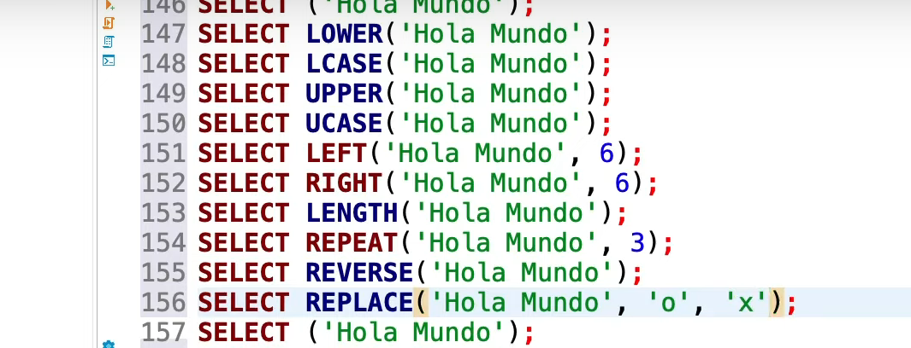
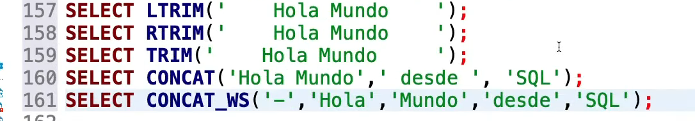

- Campos calculados
```sql
SELECT COUNT(DISTINCT age) AS Total_Registros_Diferentes
FROM `my_database`.my_table;
-- En la tabla `my_database`.my_table hay valores repetidos de 'age', devolverá la cantidad de registros para cada valor de 'age' 
SELECT age, COUNT(*) FROM `my_database`.my_table GROUP BY age;
-- HAVING es el WHERE de campos calculados
SELECT age, COUNT(*) AS total_por_edad FROM `my_database`.my_table WHERE last_name = "Hararec" GROUP BY age HAVING total_por_edad < 7;
-- El ordenamiento simpre va al final del código
SELECT * FROM `my_database`.my_table ORDER BY age ASC;
SELECT * FROM `my_database`.my_table ORDER BY age DESC;
```


- Crear registro en una tabla
```sql
-- Se puede usar esta sintaxis
INSERT INTO `my_database`.my_table SET name = "John", email = "jones@gmail.com", edad = 18;
-- Insertar un registro
INSERT INTO `my_database`.my_table (name, email, age) VALUES ("John", "jones@gmail.com", 18);
-- Insertar varios registros
INSERT INTO `my_database`.my_table (name, email, age) VALUES 
("John", "jones@gmail.com", 18),
("Mircha", "mircha@gmail.com", 38),
("Hararec", "hararecmedina@gmail.com", 29),
("Nat", "natmartinez@gmail.com", 23);
```

- Actualizar registros en una tabla
```sql
-- Siempre se tiene que usar la clausula WHERE
UPDATE `my_database`.my_table SET email = "nuevo_email@gmail.com", age = 29 WHERE id = 1729;
```

- Borrar registros en una tabla
```sql
-- Siempre se tiene que usar la clausula WHERE
DELETE FROM `my_database`.my_table WHERE id = 1729;
-- Borrar todad la tabla sin perder referencia de id
DELETE FROM `my_database`.my_table;
-- Borrar todad la tabla perdinedo referencia de id
TRUNCATE TABLE `my_database`.my_table;
```
- JOINS

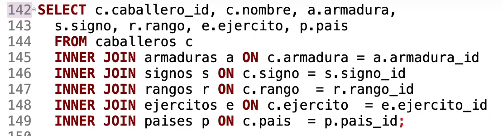

- SUBCONSULTAS (pueden usar muchos recursos del servidor)
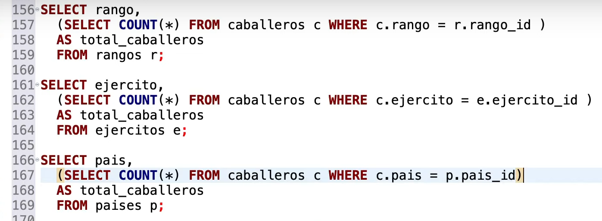

- VISTAS (son tratadas como tablas)
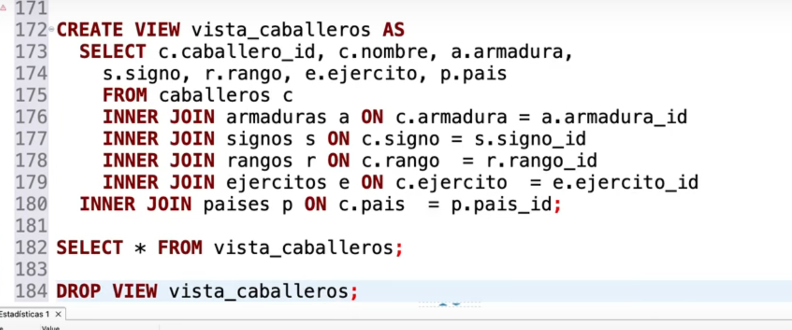


- TRANSACCIONES
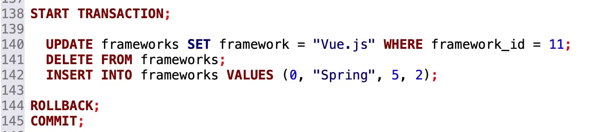

- ENCRIPTACIÓN NATIVA
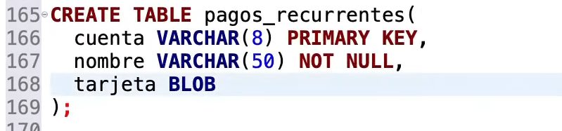
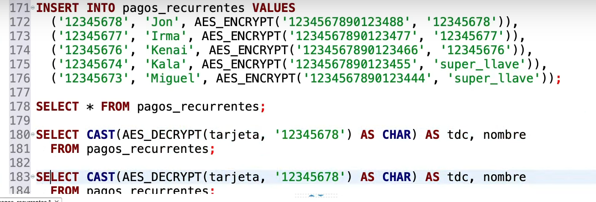

- STORE PROCEDURES
  - El archivo donde se crea el store procedure debe ser un script independiente 

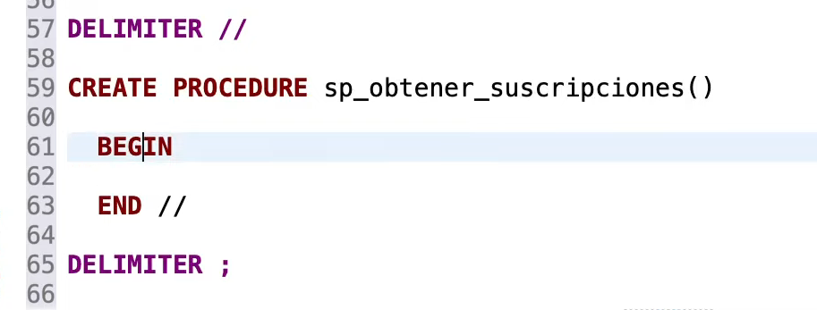
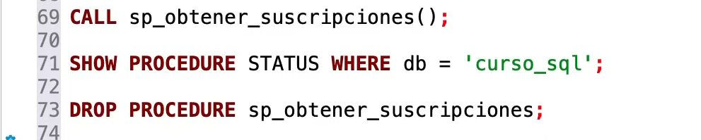

### Sentencias DCL
Los usuarios tienen la notación `username@host` (donde `host` puede ser un dominio o ip)

- Crear usuario
```sql
CREATE USER 'my_username'@'localhost' IDENTIFIED BY 'my_password';
```

- Dar todos los privilegios sobre una base de datos a un determinado usuario en un host
```sql
GRANT ALL PRIVILEGES ON my_database TO 'my_username'@'localhost';
```

- Actualizar lista de privilegios para los usuarios
```sql
FLUSH PRIVILEGES;
```
- Ver los privilegios que tiene un usuario
```sql
SHOW GRANTS FOR 'my_username'@'localhost';
```
- Quitar los privilegios a un usuario
```sql
REVOKE ALL, GRANT OPTION FROM 'my_username'@'localhost';
```
- Eliminar usuario
```sql
DROP USER 'my_username'@'localhost';
```
